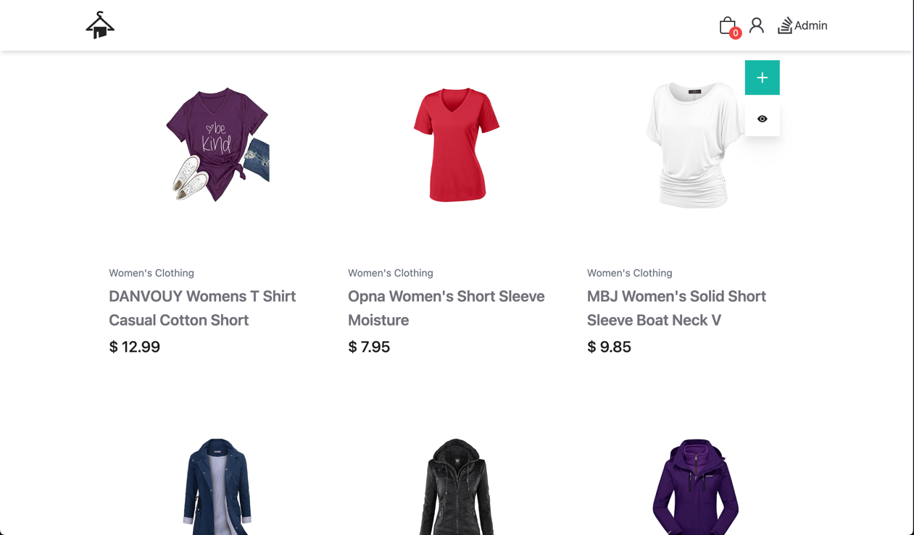

# TopSquad MicroService

Welcome to TopSquad MicroService!
This project is a full-stack ecommerce project, which contains a React storefront and a Spring Boot  microservice backend.
This README.md file will guide you on how to install and run the project using Maven.

## Overall Description
This project use back-end microservice architecture for better scalability and maintainability. 
This consists of five services: product service, order service, and inventory service, api gateway and discovery service.

### Features
- Service discovery and registration using Eureka.
- API Gateway implementation with Spring Cloud Gateway.
- OAuth2 & PCKE authorization with Keycloak.
- Efficient handling of product, order, and inventory-related operations.
- WebClient is used for robust and secure intercommunication between services.

### Tech Stack Used
The project utilizes the following tech stack:
- Back-end: Java, Spring Boot, Maven, Eureka, Spring Cloud Gateway, Eureka Discovery Server,...
- Front-end: React, Vite, Refine, AntD.
- Database: MongoDB, MySQL.
- Keycloak (Authorization Server)
- Swagger (for API documentation)

### Useful Links
- Keycloak admin management: `http://localhost:8181`
- Eureka server: `http://localhost:8080/eureka/web`
- Swagger UI: `http://localhost:8080/swagger-ui.html`
## API Documentation with Swagger
To explore the API documentation and interact with the TopSquad MicroService API, access the Swagger UI using the following URL after starting up the application: [Swagger UI](http://localhost:8080/swagger-ui.html) or `http://localhost:8080/swagger-ui.html`.

### Product API


### Inventory API

### Order API

## Eureka Server Discovery
Go to [Eureka server](http://localhost:8080/eureka/web) or `http://localhost:8080/eureka/web` to view all available instances of services after installation and successfully starting the app.
The website will look like below:

## Demo Front-End




## Installation and Running with Maven

To install and run the project, follow these steps:

1. Clone the project repository from [GitHub](https://github.com/your-repository-link).
2. Navigate to the project's root directory.
3. Make sure Docker or Docker Demon is installed on the machine.

### Back-end installation
1. Startup Spring Boot backend with `docker-compose`:
   ```bash
   docker compose up
   ```
2. The server will be available through the port `8080`.  In case you need to stop the server, run:
   ```bash
   docker compose down
   ```

### Front-end installation
1. Navigate to `refine-commerce` folder inside the root directory
2. Install all the required dependencies by running the following command:
   ```bash
   npm install
   ```
3. Start the project which will run on port `5173`
   ```bash
   npm run start
   ```
4. Now you can access to the store via: `http://localhost:5173` and the admin via: `http://localhost:5173/admin`

## Default Accounts
### Keycloak authorization server admin management
- Access via: `http://localhost:8181`
- Username: `admin`
- Password: `admin`

### Default user account for React app
- Username: `admin@example.com`
- Password: `admin`
## Future Goals
Implement more services: message broker with Kafka, circuit breaker with Resilience4J, distributed tracing, monitoring,...

Feel free to explore the project and leverage its features for your own needs.

If you have any questions or need further assistance, please don't hesitate to reach out.

Cheers!